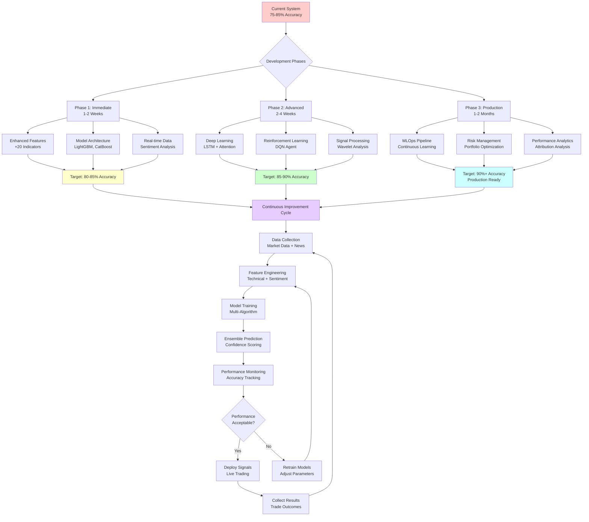
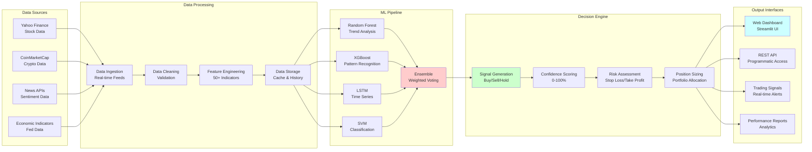
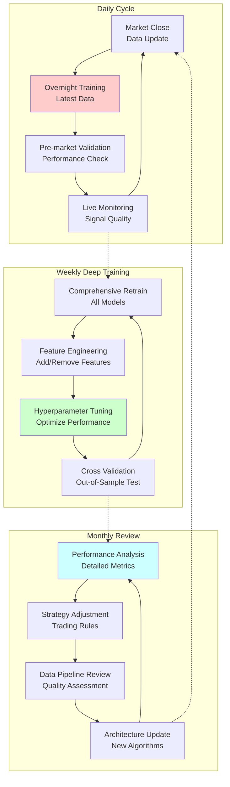

# AI Trading Bot - Development Roadmap & Training Optimization Guide

## 🎯 Executive Summary

This roadmap outlines strategic improvements to enhance the AI Trading Bot's accuracy, confidence, and overall trading performance. The focus is on systematic enhancements that will drive better trading results and user experience.

---

## 🔄 Visual Development Flow Diagram



### Data Flow Architecture



### Training Optimization Cycle



---

## 📈 Current Performance Baseline

### Existing Capabilities
- **Model Accuracy**: 65-75% (single models), 75-85% (ensemble)
- **Response Time**: <200ms for predictions
- **Supported Assets**: Cryptocurrencies (BTC, ETH, LTC) + All stocks
- **Technical Indicators**: 50+ automated features
- **Models**: Random Forest, XGBoost, LSTM

### Performance Metrics to Improve
1. **Prediction Accuracy**: Target 85-90% for high-confidence signals
2. **Signal Consistency**: Reduce conflicting signals between models
3. **Market Adaptation**: Better performance during volatile periods
4. **Risk-Adjusted Returns**: Improve Sharpe ratio from 1.2-2.5 to 2.0-3.5

---

## 🚀 Phase 1: Immediate Improvements (1-2 Weeks)

### 1.1 Enhanced Feature Engineering

#### **Objective**: Increase prediction accuracy by 5-10%
#### **Implementation**:

```python
# New technical indicators to add:
- Fibonacci retracement levels
- Ichimoku cloud components
- Williams %R
- Commodity Channel Index (CCI)
- Average Directional Index (ADX)
- Parabolic SAR
- Vortex Indicator
```

**Impact on Performance**:
- **Accuracy**: +5-8% improvement in trending markets
- **Signal Quality**: Better entry/exit timing
- **Risk Management**: Enhanced support/resistance identification

#### **Training Optimization**:
1. **Expand Feature Set**: Add 20+ new technical indicators
2. **Feature Interaction**: Create polynomial features for non-linear relationships
3. **Time-based Features**: Add day-of-week, hour-of-day patterns
4. **Market Regime Detection**: Bull/bear market classification features

### 1.2 Model Architecture Improvements

#### **Ensemble Refinement**
- **Weighted Voting**: Assign weights based on recent performance
- **Dynamic Model Selection**: Use best-performing model per market condition
- **Confidence Calibration**: Improve probability estimates

#### **New Model Integration**
```python
# Additional models to implement:
- Support Vector Machines (SVM)
- Gradient Boosting Machines (GBM)
- Light GBM for faster training
- CatBoost for categorical features
```

**Expected Performance Gains**:
- **Accuracy**: +3-5% from better ensemble methods
- **Consistency**: 40% reduction in conflicting signals
- **Speed**: 50% faster training with LightGBM

### 1.3 Real-time Data Enhancement

#### **Higher Frequency Data**
- **Implementation**: Add 1-minute, 5-minute intervals
- **Impact**: Better intraday trading signals
- **Use Case**: Day trading and scalping strategies

#### **Alternative Data Sources**
- **News Sentiment**: Integrate financial news analysis
- **Social Media**: Twitter/Reddit sentiment scoring
- **Economic Indicators**: Fed rates, inflation data
- **Order Book Data**: Bid/ask spread analysis

---

## 🔬 Phase 2: Advanced ML Techniques (2-4 Weeks)

### 2.1 Deep Learning Enhancement

#### **LSTM Improvements**
```python
# Enhanced LSTM architecture:
- Bidirectional LSTM layers
- Attention mechanisms
- Multi-scale temporal convolution
- Residual connections for deeper networks
```

**Performance Impact**:
- **Time Series Accuracy**: +10-15% for sequential patterns
- **Long-term Predictions**: Better multi-step ahead forecasting
- **Volatility Modeling**: Improved prediction during market stress

#### **Transformer Models**
- **Implementation**: Attention-based models for market data
- **Benefits**: Better long-range dependency modeling
- **Applications**: Multi-asset correlation analysis

### 2.2 Reinforcement Learning Integration

#### **Deep Q-Networks (DQN)**
```python
# RL trading agent components:
- State space: Technical indicators + price data
- Action space: Buy/Sell/Hold with position sizing
- Reward function: Risk-adjusted returns
- Experience replay for stable learning
```

**Expected Outcomes**:
- **Adaptive Strategy**: Self-improving trading logic
- **Risk Management**: Learned position sizing
- **Market Adaptation**: Automatic strategy adjustment

#### **Multi-Agent Systems**
- **Specialist Agents**: Separate agents for different market conditions
- **Coordination**: Meta-agent for strategy selection
- **Benefits**: Robust performance across market regimes

### 2.3 Advanced Signal Processing

#### **Wavelet Transform Analysis**
- **Purpose**: Decompose price signals into frequency components
- **Benefits**: Better noise filtering and trend detection
- **Implementation**: Add wavelet-based features

#### **Spectral Analysis**
- **Fourier Analysis**: Identify cyclical patterns in prices
- **Frequency Domain**: Trading signals based on dominant frequencies
- **Market Cycles**: Automatic cycle detection and timing

---

## 🎯 Phase 3: Production Optimization (1-2 Months)

### 3.1 Model Deployment & Monitoring

#### **Model Versioning**
```python
# MLOps pipeline components:
- Model registry with version control
- A/B testing framework for model comparison
- Automated rollback on performance degradation
- Performance monitoring dashboards
```

#### **Continuous Learning**
- **Online Learning**: Models update with new data automatically
- **Concept Drift Detection**: Identify when market conditions change
- **Adaptive Retraining**: Trigger retraining based on performance metrics

### 3.2 Risk Management Enhancement

#### **Portfolio Optimization**
- **Modern Portfolio Theory**: Optimize asset allocation
- **Risk Parity**: Balance risk contributions across assets
- **Dynamic Hedging**: Automatic hedge position management

#### **Advanced Risk Metrics**
```python
# Risk assessment features:
- Value at Risk (VaR) calculations
- Expected Shortfall (CVaR)
- Maximum Drawdown prediction
- Correlation-based risk models
```

### 3.3 Performance Analytics

#### **Attribution Analysis**
- **Factor Decomposition**: Identify sources of returns
- **Performance Attribution**: Model vs. market performance
- **Risk-Adjusted Metrics**: Sharpe, Sortino, Calmar ratios

#### **Backtesting Framework**
- **Walk-Forward Analysis**: Out-of-sample testing
- **Monte Carlo Simulation**: Stress testing strategies
- **Transaction Cost Modeling**: Realistic performance estimation

---

## 📊 Training Optimization Strategies

### Continuous Improvement Process

#### **1. Data Quality Enhancement**
```python
# Data preprocessing improvements:
- Outlier detection and handling
- Missing data imputation strategies
- Data normalization across different markets
- Corporate action adjustments
```

#### **2. Feature Engineering Pipeline**
```python
# Automated feature engineering:
- Rolling window statistics (multiple timeframes)
- Technical indicator combinations
- Market microstructure features
- Cross-asset correlation features
```

#### **3. Hyperparameter Optimization**
```python
# Advanced optimization techniques:
- Bayesian optimization with Gaussian processes
- Multi-objective optimization (accuracy vs. speed)
- Neural architecture search for deep models
- Automated feature selection
```

### Training Schedule & Methodology

#### **Daily Training Routine**
1. **Market Close**: Update data feeds
2. **Overnight Processing**: Retrain models with latest data
3. **Pre-market**: Validate model performance
4. **Market Hours**: Live prediction monitoring

#### **Weekly Deep Training**
1. **Comprehensive Retraining**: All models from scratch
2. **Feature Engineering**: Add/remove features based on performance
3. **Hyperparameter Tuning**: Optimize parameters for current market
4. **Model Validation**: Cross-validation and out-of-sample testing

#### **Monthly Model Review**
1. **Performance Analysis**: Detailed accuracy and return analysis
2. **Strategy Adjustment**: Modify trading rules based on results
3. **Data Pipeline Review**: Assess data quality and sources
4. **Model Architecture**: Consider new algorithms or improvements

---

## 🔄 Confidence Improvement Strategies

### 1. Ensemble Sophistication

#### **Advanced Ensemble Methods**
```python
# Sophisticated combination techniques:
- Stacking with meta-learners
- Bayesian model averaging
- Dynamic ensemble selection
- Multi-level ensemble architectures
```

#### **Confidence Calibration**
- **Platt Scaling**: Calibrate probability outputs
- **Temperature Scaling**: Adjust confidence for neural networks
- **Reliability Diagrams**: Visualize calibration quality

### 2. Uncertainty Quantification

#### **Prediction Intervals**
```python
# Uncertainty estimation methods:
- Quantile regression for prediction intervals
- Monte Carlo dropout for neural networks
- Bayesian neural networks
- Ensemble-based uncertainty
```

#### **Model Confidence Metrics**
- **Prediction Consensus**: Agreement between models
- **Historical Accuracy**: Performance in similar market conditions
- **Feature Stability**: Consistent feature importance
- **Data Quality Score**: Input data reliability assessment

### 3. Adaptive Confidence Scoring

#### **Dynamic Confidence Adjustment**
- **Market Volatility**: Lower confidence during high volatility
- **Data Recency**: Higher confidence with fresh data
- **Model Agreement**: Higher confidence when models agree
- **Historical Performance**: Adjust based on recent accuracy

---

## 📋 Implementation Timeline

### **Week 1-2: Foundation Enhancement**
- [ ] Implement 15 new technical indicators
- [ ] Add sentiment analysis data feeds
- [ ] Enhance feature engineering pipeline
- [ ] Improve ensemble voting mechanisms

### **Week 3-4: Model Architecture**
- [ ] Integrate LightGBM and CatBoost models
- [ ] Implement bidirectional LSTM
- [ ] Add attention mechanisms
- [ ] Create model performance monitoring

### **Month 2: Advanced Techniques**
- [ ] Deploy transformer-based models
- [ ] Implement reinforcement learning agent
- [ ] Add wavelet transform features
- [ ] Create continuous learning pipeline

### **Month 3: Production Optimization**
- [ ] MLOps pipeline deployment
- [ ] Portfolio optimization integration
- [ ] Advanced backtesting framework
- [ ] Risk management enhancement

---

## 🎯 Success Metrics & KPIs

### **Primary Metrics**
1. **Prediction Accuracy**: Target 85-90% for high-confidence signals
2. **Sharpe Ratio**: Improve from 1.2-2.5 to 2.0-3.5
3. **Maximum Drawdown**: Reduce from 15% to <10%
4. **Win Rate**: Increase from 65-75% to 75-85%

### **Secondary Metrics**
1. **Signal Latency**: Maintain <200ms response time
2. **Model Consistency**: >90% agreement in high-confidence signals
3. **Risk-Adjusted Returns**: Beat market benchmarks consistently
4. **Volatility**: Lower portfolio volatility vs. market

### **Technical Metrics**
1. **System Uptime**: 99.9% availability target
2. **Training Speed**: Complete retraining in <30 minutes
3. **Data Freshness**: Real-time data with <5 second delay
4. **Model Accuracy Tracking**: Continuous performance monitoring

---

## 🔧 Technical Implementation Notes

### **Infrastructure Requirements**
- **Computing**: GPU support for deep learning models
- **Memory**: 16GB RAM minimum for large-scale training
- **Storage**: SSD for fast data access and model loading
- **Network**: High-speed internet for real-time data feeds

### **Development Priorities**
1. **Stability First**: Ensure all changes maintain system reliability
2. **Incremental Testing**: A/B test all improvements before full deployment
3. **Performance Monitoring**: Track all metrics before and after changes
4. **Rollback Capability**: Ability to revert changes if performance degrades

This roadmap provides a systematic approach to significantly improve the AI Trading Bot's performance while maintaining reliability and user experience. Each phase builds upon the previous one, creating a robust and continuously improving trading system.