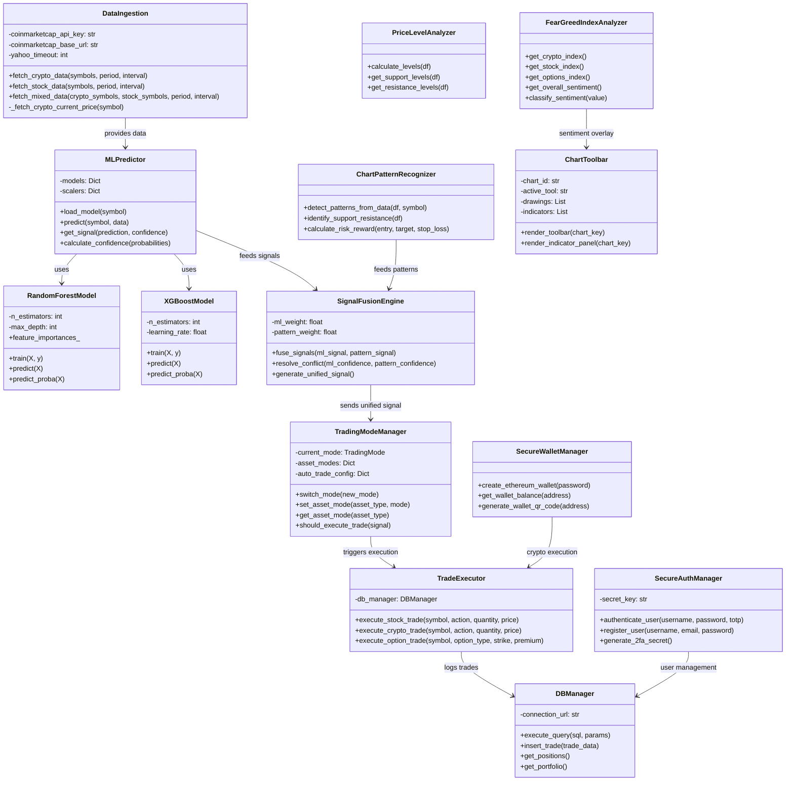

# IntelliTradeAI System Architecture

## Class Diagram (Mermaid)



## Data Flow Diagram

```
┌─────────────────────────────────────────────────────────────────────────────┐
│                           DATA SOURCES                                       │
├─────────────────────────────────────────────────────────────────────────────┤
│                                                                              │
│  ┌─────────────────────┐         ┌─────────────────────┐                    │
│  │   Yahoo Finance     │         │   CoinMarketCap     │                    │
│  │   (Free API)        │         │   (Paid API)        │                    │
│  ├─────────────────────┤         ├─────────────────────┤                    │
│  │ - Historical OHLCV  │         │ - Real-time prices  │                    │
│  │ - 5-10 years data   │         │ - Market cap        │                    │
│  │ - Stocks & Crypto   │         │ - Top 10 coins      │                    │
│  │ - Daily intervals   │         │ - 24h changes       │                    │
│  └──────────┬──────────┘         └──────────┬──────────┘                    │
│             │                               │                                │
│             └───────────────┬───────────────┘                                │
│                             ▼                                                │
│                  ┌─────────────────────┐                                    │
│                  │   DataIngestion     │                                    │
│                  │   (Hybrid Fetcher)  │                                    │
│                  └──────────┬──────────┘                                    │
└─────────────────────────────┼───────────────────────────────────────────────┘
                              │
                              ▼
┌─────────────────────────────────────────────────────────────────────────────┐
│                         DATA PROCESSING                                      │
├─────────────────────────────────────────────────────────────────────────────┤
│                                                                              │
│  ┌─────────────────────────────────────────────────────────────────────┐    │
│  │                    Technical Indicators Engine                       │    │
│  ├─────────────────────────────────────────────────────────────────────┤    │
│  │  SMA (20, 50, 200)  │  EMA (12, 26)  │  Bollinger Bands  │  RSI    │    │
│  │  MACD               │  ATR           │  Fibonacci        │  Volume │    │
│  └─────────────────────────────────────────────────────────────────────┘    │
│                              │                                               │
│              ┌───────────────┼───────────────┐                              │
│              ▼               ▼               ▼                              │
│  ┌───────────────┐  ┌───────────────┐  ┌───────────────┐                   │
│  │ Random Forest │  │   XGBoost     │  │    LSTM       │                   │
│  │   Model       │  │   Model       │  │   (Optional)  │                   │
│  │ Acc: 47-79%   │  │ Acc: 50-82%   │  │ Acc: 55-75%   │                   │
│  └───────────────┘  └───────────────┘  └───────────────┘                   │
│              │               │               │                              │
│              └───────────────┼───────────────┘                              │
│                              ▼                                               │
│                  ┌─────────────────────┐                                    │
│                  │  Signal Fusion      │                                    │
│                  │  Engine             │                                    │
│                  │  (Conflict Resolver)│                                    │
│                  └──────────┬──────────┘                                    │
└─────────────────────────────┼───────────────────────────────────────────────┘
                              │
                              ▼
┌─────────────────────────────────────────────────────────────────────────────┐
│                         TRADING EXECUTION                                    │
├─────────────────────────────────────────────────────────────────────────────┤
│                                                                              │
│  ┌─────────────────────┐         ┌─────────────────────┐                    │
│  │  Trading Mode       │         │  Trade Executor     │                    │
│  │  Manager            │────────▶│                     │                    │
│  ├─────────────────────┤         ├─────────────────────┤                    │
│  │ Manual: User decide │         │ Stocks: Market/Limit│                    │
│  │ Auto: AI executes   │         │ Crypto: Blockchain  │                    │
│  │ Per-asset toggles   │         │ Options: Chain API  │                    │
│  └─────────────────────┘         └─────────┬───────────┘                    │
│                                            │                                │
│                                            ▼                                │
│                              ┌─────────────────────┐                        │
│                              │  PostgreSQL Database │                        │
│                              │  (Trade Log & P&L)   │                        │
│                              └─────────────────────┘                        │
└─────────────────────────────────────────────────────────────────────────────┘
```

## Data Sources Summary

| Source | Type | Data Provided | Period Available | Cost |
|--------|------|---------------|------------------|------|
| Yahoo Finance | REST API | Historical OHLCV, Volume | Up to 10+ years | Free |
| CoinMarketCap | REST API | Real-time prices, Market Cap, 24h Change | Current | Paid (API Key Required) |

### Yahoo Finance Symbols
- **Stocks**: Direct ticker (e.g., AAPL, MSFT, GOOGL)
- **Crypto**: Ticker-USD format (e.g., BTC-USD, ETH-USD)

### Supported Assets (38 Total)

**Cryptocurrencies (20):**
BTC, ETH, USDT, XRP, BNB, SOL, USDC, TRX, DOGE, ADA, AVAX, SHIB, TON, DOT, LINK, BCH, LTC, XLM, WTRX, STETH

**Stocks (18):**
AAPL, MSFT, GOOGL, AMZN, NVDA, META, TSLA, JPM, WMT, JNJ, V, BAC, DIS, NFLX, INTC, AMD, CRM, ORCL

## Model Performance Metrics

### Current Model Accuracy (Random Forest - 1 Year Data)

| Asset Type | Min Accuracy | Max Accuracy | Average |
|------------|-------------|--------------|---------|
| Cryptocurrencies | 47% | 72% | 58% |
| Stocks | 52% | 79% | 64% |

### Expected Improvement with Extended Data (5-10 Years)

| Metric | 1 Year Data | 5 Year Data | 10 Year Data |
|--------|-------------|-------------|--------------|
| Training Samples | ~250 | ~1,250 | ~2,500 |
| Pattern Recognition | Limited | Better seasonality | Full cycle coverage |
| Model Stability | Moderate | High | Very High |
| Expected Accuracy Gain | Baseline | +8-12% | +12-18% |

### Model Ensemble Strategy

```
┌─────────────────────────────────────────────────────────────────┐
│                    ENSEMBLE PREDICTION                           │
├─────────────────────────────────────────────────────────────────┤
│                                                                  │
│   Random Forest (40%)  +  XGBoost (40%)  +  Pattern AI (20%)   │
│         │                    │                   │              │
│         ▼                    ▼                   ▼              │
│   ┌───────────┐        ┌───────────┐      ┌───────────┐        │
│   │ Tree-based│        │ Gradient  │      │ Technical │        │
│   │ Voting    │        │ Boosting  │      │ Patterns  │        │
│   └───────────┘        └───────────┘      └───────────┘        │
│         │                    │                   │              │
│         └────────────────────┼───────────────────┘              │
│                              ▼                                   │
│                    ┌─────────────────┐                          │
│                    │ Signal Fusion   │                          │
│                    │ Engine          │                          │
│                    ├─────────────────┤                          │
│                    │ BUY | SELL | HOLD                          │
│                    │ Confidence: 0-100%                         │
│                    └─────────────────┘                          │
└─────────────────────────────────────────────────────────────────┘
```

### Feature Engineering (70+ Features)

| Category | Features | Description |
|----------|----------|-------------|
| Price | Open, High, Low, Close | Raw OHLC data |
| Volume | Volume, Volume MA | Trading volume indicators |
| Moving Averages | SMA 20/50/200, EMA 12/26 | Trend indicators |
| Momentum | RSI, MACD, Stochastic | Overbought/oversold |
| Volatility | Bollinger Bands, ATR | Price volatility |
| Patterns | Head & Shoulders, Wedges | Chart patterns |
| Time | Day of week, Month | Seasonal features |

## TradingView-Style Chart Toolbar

### Available Tools

| Category | Tools | Description |
|----------|-------|-------------|
| Drawing | Trendline, H-Line, V-Line, Ray, Channel | Manual drawing tools |
| Fibonacci | Retracement, Extension, Fan | Fibonacci analysis |
| Shapes | Rectangle, Ellipse, Triangle, Arrow | Shape annotations |
| Indicators | SMA, EMA, Bollinger, RSI, MACD, Volume | Technical overlays |

### Time Ranges Available

- 1 Day, 1 Week, 1 Month, 3 Months, 6 Months
- 1 Year, 2 Years, **5 Years**, 10 Years, Max

---

*Last Updated: December 2025*
*Data Period: Extended to 5-10 years for improved model training*
